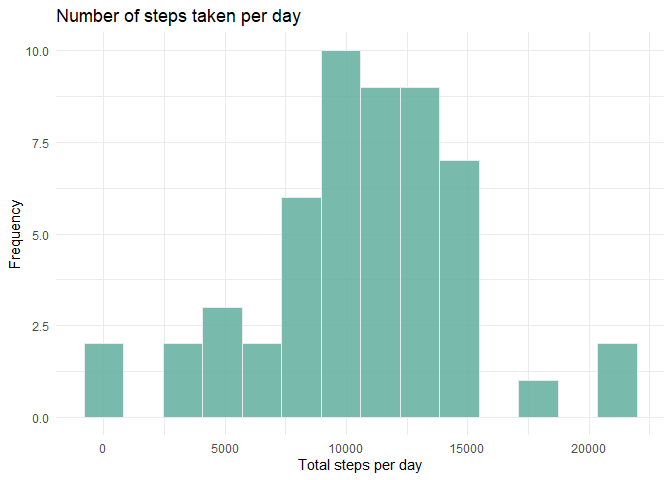
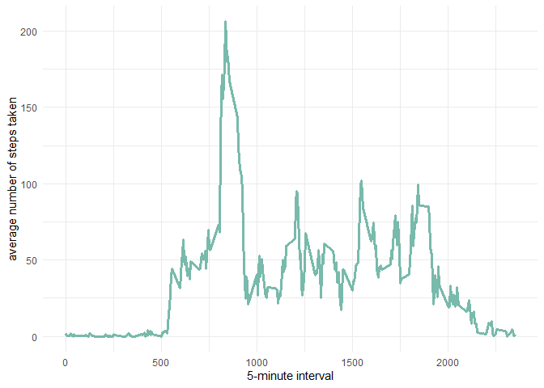
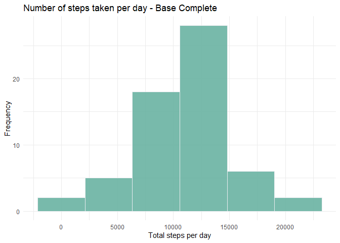
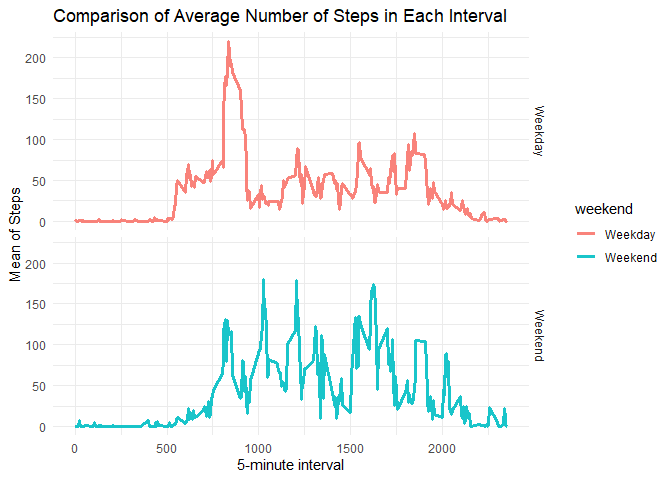

## Loading and preprocessing the data

### Process description

- Load the data
- Processing and transformation of data in a format suitable for analysis


```r
    # download file from web
    if(!file.exists("db_v1.0.zip"))
       download.file("https://d396qusza40orc.cloudfront.net/repdata%2Fdata%2Factivity.zip",
                  destfile = "db_v1.0.zip", mode="wb")
    # unzip data and read 
    if(!file.exists("activity.csv")) unzip("db_v1.0.zip")
    df_job <- read.csv("activity.csv", header = TRUE)
    head(df_job)
```

```
##   steps       date interval
## 1    NA 2012-10-01        0
## 2    NA 2012-10-01        5
## 3    NA 2012-10-01       10
## 4    NA 2012-10-01       15
## 5    NA 2012-10-01       20
## 6    NA 2012-10-01       25
```

## What is mean total number of steps taken per day?


```r
    databydate <- df_job %>%
                  select(date, steps) %>% 
                  group_by(date) %>%
                  summarize(tsteps = sum(steps)) %>%
                  na.omit() %>% as.data.frame()

    vmean_1 <- as.character(round(mean(databydate$tsteps, na.rm=TRUE),2))
    vmedian_1 <-  as.character(round(median(databydate$tsteps, na.rm=TRUE),2))  
    n_binds = round(1 + 1.332*log(nrow(df_job)),0)
    
    ggplot(databydate, aes(x=tsteps)) +
    geom_histogram(bins=n_binds, fill="#69b3a2", color="#e9ecef", alpha=0.9) +
    ggtitle("Number of steps taken per day") +
    labs(x = "Total steps per day",y = "Frequency") +     
    theme_minimal()
```

<!-- -->

> The mean of the total number of steps taken per day is ***10766.19*** and median is ***10765*** 
 
## What is the average daily activity pattern?

### 1. Time series plot


```r
    databyinterval <- df_job %>%
                      select(interval, steps) %>% 
                      na.omit() %>%
                      group_by(interval) %>%
                      summarize(tsteps= mean(steps)) 
    ggplot(databyinterval, aes(x=interval, y=tsteps)) +
    geom_line(fill="#e9ecef", color="#69b3a2", alpha=0.9, size=1.2) +
    xlab("5-minute interval") +
    ylab("average number of steps taken") +     
    theme_minimal()
```

<!-- -->


```r
    mostSteps <- which.max(databyinterval$tsteps)
    timeMostSteps <-  gsub("([0-9]{1,2})([0-9]{2})", "\\1:\\2",   databyinterval[mostSteps,"interval"])
```

> On average across all the days in the dataset, the 5-minute interval contains the maximum number of steps?
Most Steps at: ***8:35***


## Imputing missing values

There are many days/intervals where there are missing values __(coded as `NA`).__ The presence of missing days may introduce bias into some calculations or summaries of the data


```r
    missing <- is.na(df_job$steps)
    table_missings <- as.data.frame(table(missing))
    print(xtable(table_missings), type = "html", 
    html.table.attributes = 'align="center", 
                             rules="rows", 
                             width=50%,
                             frame="below"')
```

<!-- html table generated in R 3.6.1 by xtable 1.8-4 package -->
<!-- Wed Jul 29 15:37:51 2020 -->
<table align="center", 
                             rules="rows", 
                             width=50%,
                             frame="below">
<tr> <th>  </th> <th> missing </th> <th> Freq </th>  </tr>
  <tr> <td align="right"> 1 </td> <td> FALSE </td> <td align="right"> 15264 </td> </tr>
  <tr> <td align="right"> 2 </td> <td> TRUE </td> <td align="right"> 2304 </td> </tr>
   </table>

&nbsp;
&nbsp;
&nbsp;  
I will use the mean for that 5 -minute interval to replace all the missing values in the dataset. At the end, I will check if all the NAs have been replaced
&nbsp;
&nbsp;
&nbsp;

  

```r
    replacewithmean <- function(x) replace(x, is.na(x), mean(x, na.rm = TRUE))
    meandata <- df_job %>% group_by(interval) %>% mutate(steps= replacewithmean(steps))
    missing <- is.na(meandata$steps)
    table_missings <- as.data.frame(table(missing))
    print(xtable(table_missings), type = "html", 
    html.table.attributes = 'align="center", 
                             rules="rows", 
                             width=50%,
                             frame="below"')
```

<!-- html table generated in R 3.6.1 by xtable 1.8-4 package -->
<!-- Wed Jul 29 15:37:51 2020 -->
<table align="center", 
                             rules="rows", 
                             width=50%,
                             frame="below">
<tr> <th>  </th> <th> missing </th> <th> Freq </th>  </tr>
  <tr> <td align="right"> 1 </td> <td> FALSE </td> <td align="right"> 17568 </td> </tr>
   </table>
&nbsp;
&nbsp;
&nbsp;
Now, using the filled data set, let's make a histogram of the total number of steps taken each day and calculate the mean and median total number of steps.
  
  

```r
    FullByDay <- aggregate(meandata$steps, by=list(meandata$date), sum)
    names(FullByDay)[1] ="date"
    names(FullByDay)[2] ="totalsteps"

    vmean_2 <- as.character(round(mean(FullByDay$totalsteps, na.rm=TRUE),2))
    vmedian_2 <-  as.character(round(median(FullByDay$totalsteps, na.rm=TRUE),2))  
    n_binds = round(1 + 1.332*log(nrow(FullByDay)),0)
    
    ggplot(FullByDay, aes(x=totalsteps)) +
    geom_histogram(bins=n_binds, fill="#69b3a2", color="#e9ecef", alpha=0.9) +
    ggtitle("Number of steps taken per day - Base Complete") +
    labs(x = "Total steps per day",y = "Frequency") +     
    theme_minimal()
```

<!-- -->

> The mean of the total number of steps taken per day is ***10766.19*** and median is ***10766.19*** for data base camplete, comparate to the mean is ***10766.19*** and median is ***10765*** for raw data  


## Are there differences in activity patterns between weekdays and weekends?


```r
    meandata$date <- as.Date(meandata$date)
    meandata$weekday <- weekdays(meandata$date)
    
    meandata$weekend <- ifelse(
                        meandata$weekday=="domingo" | meandata$weekday=="s攼㸱bado",
                        "Weekend", "Weekday")
    
    weekendweekday <- aggregate(meandata$steps ,
                                        by= list(meandata$weekend,
                                        meandata$interval), na.omit(mean))
    names(weekendweekday) <- c("weekend", "interval", "steps")
    
    ggplot(weekendweekday, aes(x=interval, y=steps, color = weekend)) +
    geom_line(alpha=0.9, size=1.2) +
    facet_grid(weekend~.) +
    xlab("5-minute interval") + ylab("Mean of Steps") +
    ggtitle("Comparison of Average Number of Steps in Each Interval") +
    theme_minimal()
```

<!-- -->
